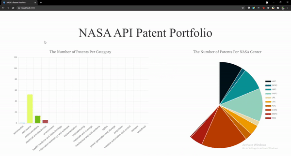

# NASA's Patent Portfolio: Categories & Centers

## Description:
This repository contains the development of a web application designed to display charts of the number of NASA api patents based on category and center. 
<br></br>
Please Note: The web application has not been deployed and can only run via local machine (http://localhost:3000). 

<div align="center">
    
</div>

## Setup: 
The following environments and technologies were used: 
1. Nodejs
2. JavaScript (node-fetch, chart.js, express), HTML, CSS (Bootstrap)
3. Visual Studio Code (IDE), WSL 2 (Ubuntu 20.04.2 LTS)
4. node v14.16.0
5. npm (7.11.1)


Clone this repository to the desired workspace path. 
Install the neccessary dependencies via npm: 
```
$ npm install
```
To start the server-side interface use the command:
```
$ npm start
```
If an 'Error: listen EADDRINUSE: address already in use :3000' occurs, simply kill all node processes before running 'npm start'. To do this use the command: 
```
$ killall -9 node
```
Run the command 'npm start' again after all node processes are stopped.

This will run the script 'nodemon server.js' which will begin the nodejs server. To restart the server via command line at any time, simply type 'rs' followed by the enter key in the terminal. 
Navigate to http://localhost:3000 to view the web application.

## Project Development and Design Choices
Disclaimer: Nodejs is a completely new environment to me and my skills in JavaScript are purely academic so the learning curve to set up the server took some time for me to understand and review what was needed. 

### Server Side (server.js)
To handle GET HTTP requests I used the node-fetch package that is similar to the client-side windows.fetch API. I used this fetch method to retrieve the NASA Patent Portfolio data. From this fetch call I reformated the data 


